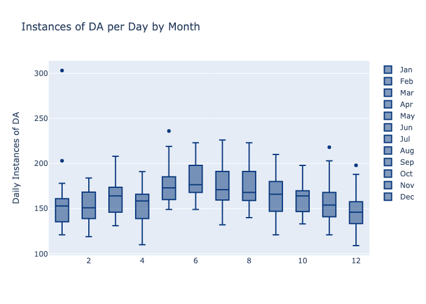

# Bureau_Analysis

## About this Project

This project works in tandem with the Tennessee Bureau of Investigation (TBI) to create an analytics report that elaborates on the impacts of Covid-19 on crime rates for Tennessee during the year 2020 in comparison to projections from the years 2018-19, with special emphasis on describing instances of **When** and **Where** Domestic Violence (DV) occur during 2020. 

### Role in Project

<ul>
    <li><strong>Interpersonal:</strong> Facilitate communication with client</li>
    <li><strong>Project Management:</strong> Establish guidelines, expectations, deadlines, and specific deliverables</li> 
    <li><strong>Collaboration:</strong> Collaborate with industry specialist to bring appropriate context and nuance to ETL and analysis processes</li>
    <li><strong>Data Scientist/Analyst:</strong> Prepare currated datasets that (1) describe the overarching goals of this project, and (2) can be used for projections during later iterations of this project.</li>
    <li><strong>Data Analyst/Statistician:</strong> Statistically test and Analyze the data, visualize patterns and insights, and tell the story of DV instances during early pandemic 2020.</li>
</ul>

### Specific Project Goals and Tasks

<ul>
    <li>Prepare Data and Analyze for <strong><em><u>When</u> DV occurs</em></strong> </li>
    <ul>
        <li>Goal: Visualize and Analyze the distribution of instances of DV during 2020 in order to highlight possible trends related to time of year, time of day, and give context to <em>When</em> DV is occurring.</li>
        <li>ETL: Determined appropriate identifiers for separate instances, collaborated with client and industry specialist for describing feature relevance and context, cross-referenced multiple databases</li>
        <li>Analysis: Utilized Plotly and Pandas for Python to analyze and visualize data.</li>
        <li>Statistics: Utlized Shapiro-Wilcox and Kolmogorov-Smirnov tests to justify which statistical tests were apporpriate to use during analysis.</li>
    </ul>
    <li>Prepare Data and Analyze for <strong><em><u>Where</u> DV occurs</em></strong> </li>
    <ul>
        <li>Goal: Visualize and Analyze the distribution of DV instances per county for the state of TN for 2020. (1) Investigate whether there are any regions or counties that have significantly different rates of DV than the rest of the state. (2) Compare DV rates and police officer numbers in order to provide client insights as to staffing or training needs that might exist relative to density of DV rates.</li>
        <li>ETL: The process matches above. One key limitation that arose during feature selection/creation was reporting inconsistencies which prevented a deeper analysis of the geography of DV instances. Analysis was limited to the county-level for this project.</li>
        <li>Analysis: Utilized Plotly Express for pie chart visuals and MS Excel for the county-by-county heatmap.</li>
</li>
    </ul>
    <li>Prepare Data for Collaborator's Modeling</li>
    <ul>
        <li>This portion of the project consisted entirely of ETL processing. I compiled data from a dozen files provided by the TBI vendors. I created functions to automate the cleaning of these many files as I compiled them into specific ready-to-load csv files.</li>
    </ul>
</ul>

### Notable Trends

<strong><em>The When</em></strong> 
The strongest emergent insights into when DV is occurring from the data are when the DV instances occur throughout the year, and when they occur throughout the day.  

"Time-series of hour of day"
"Boxplot of months" vs "seasons" (include radial histogram)
"Pie charts" (pop) vs "Heatmaps"

### Limitations and Areas for Development

--Talk about reporting issue (dates issues as well as inconsistency in reporting addresses oer mart 2)
--Arguement for Normality (tables and histograms of seasonal data)
--Development: Refactor key notebooks to be executable .py scripts for automation of future projects.
--Development: Use more specialized visualization libraries (perhaps Leaflet) for a more detailed heatmap rendering of TN's counties.
--Development: Bring data from previous years into the context of the DV project in order to create preliminary ML models of changes in rates of DV as influenced by Covid-19 or other factors. 
--Development: Work with TBI to bring greater context to similar projects to better understand the impact of Covid-19 on other crimes to determine if there is a specific "Covid" effect.